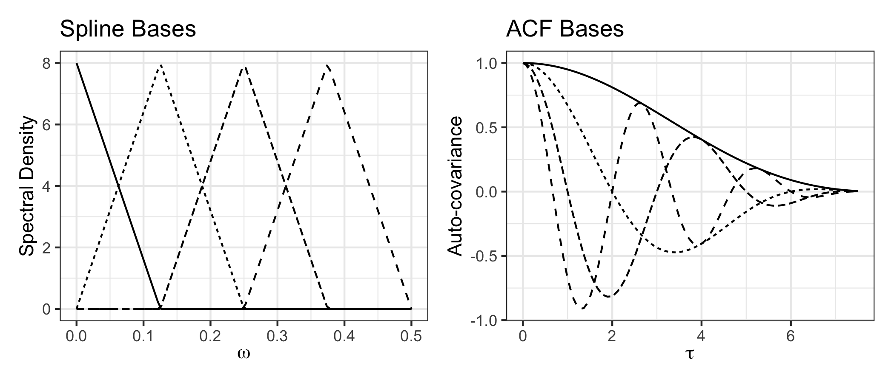

# bskernel

<!-- badges: start -->


<!-- badges: end -->

This package provides flexible auto-covariance kernel construction via
inverse Fourier transforms of B-spline bases, as well as some handy
tools for optimisation. Please note, if you have found yourself in the
GitHub repo, please navigate
[here](https://astfalckl.github.io/bskernel/) for the pkgdown page.

## Installation

You can install the development version of `bskernel` from GitHub with

``` r
devtools::install_github("astfalckl/bskernel")
```

## Quickstart

The `bskernel` package provides tools for constructing auto-covariance
functions via the inverse Fourier transform of B-spline basis functions
on the spectral domain. The workhorse functions are

- `build_bspline_design_matrix`
- `reconstruct_acf`

Below is a minimal example that recreates Figure 1 of the paper.

``` r
library(bskernel)

k <- 1 
knots <- seq(-0.125, 0.5, 0.125)
omega <- seq(0, 0.5, length.out = 100)
tau <- seq(0, 7.5, length = 100)

spline_bases <- build_bspline_design_matrix(omega, knots, k)

acfs <- sapply(1:4, function(i){
  idx <- rep(0, 4)
  idx[i] <- 1
  Re(reconstruct_acf(idx, knots, k, tau))
})
```

Note that `reconstruct_acf()` is designed to summate over a bases
expansion, here we iteratively select the basis member. The spline and
acf bases are plotted below (plotting code is suppressed, see `.Rmd`
file).



## Articles

I have written a number of tutorials:

- [Maximum Likelihood with the Gaussian
  Likelihood](reference/articles/ml_gaussian.html)
- [Function reference](reference/index.html)

### Citation

This package accompanies the paper

LC Astfalck. (2025). *‘’Universal modelling of auto-covariance functions
via spline kernels’’*. Submitted to the Journal of the Royal Statistical
Society: Series B. [\[Available
here.\]](https://arxiv.org/abs/2506.21953)
